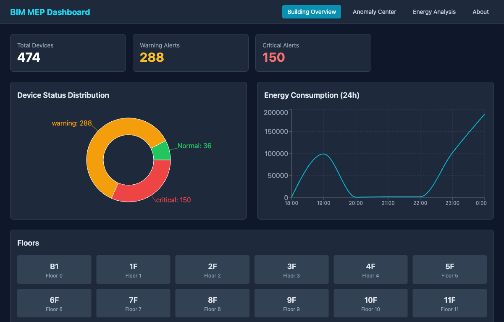
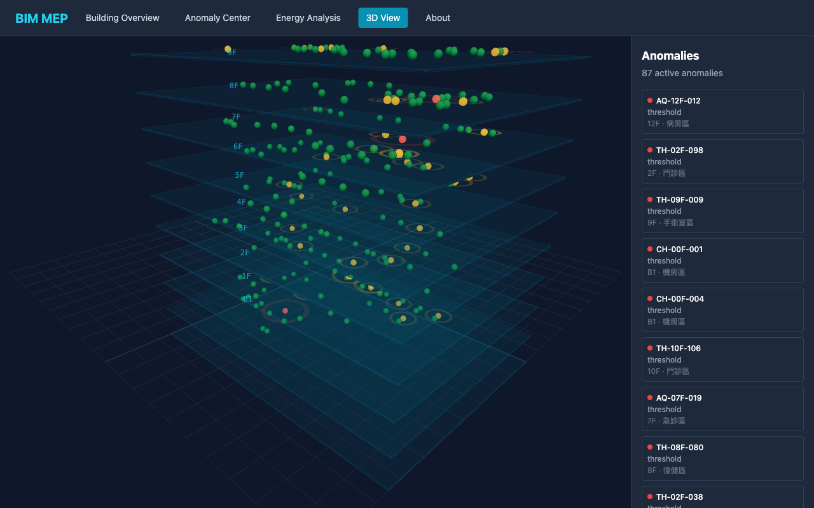
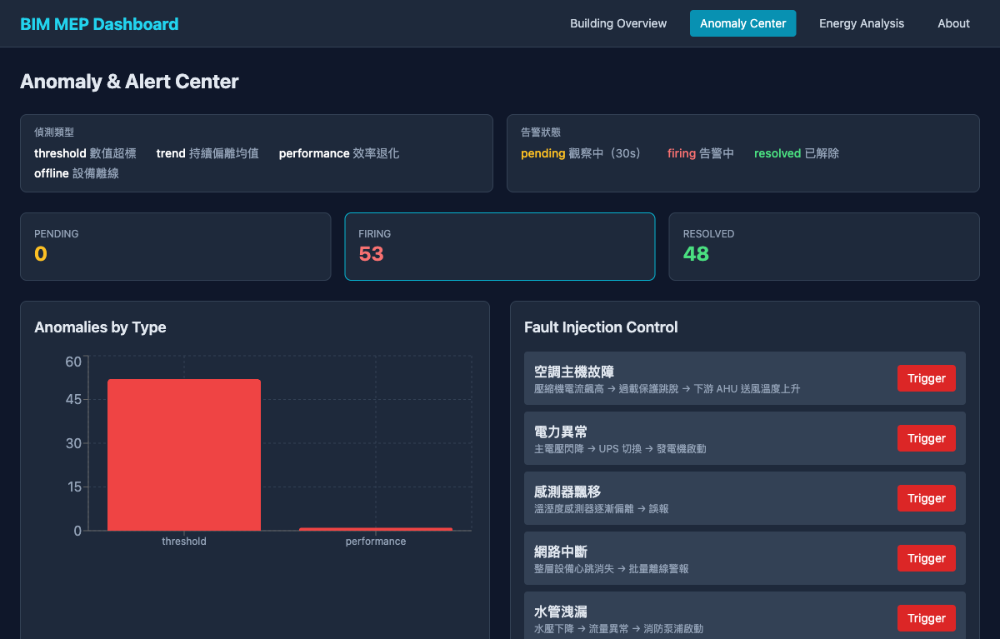
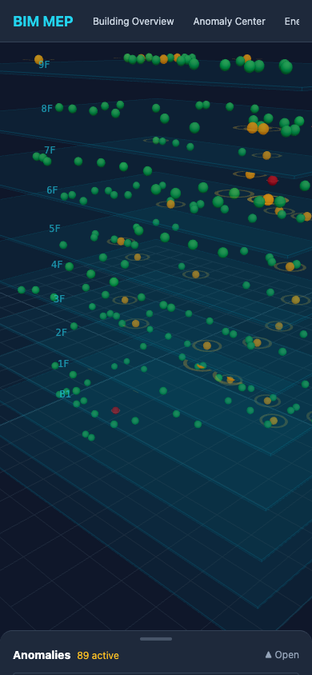
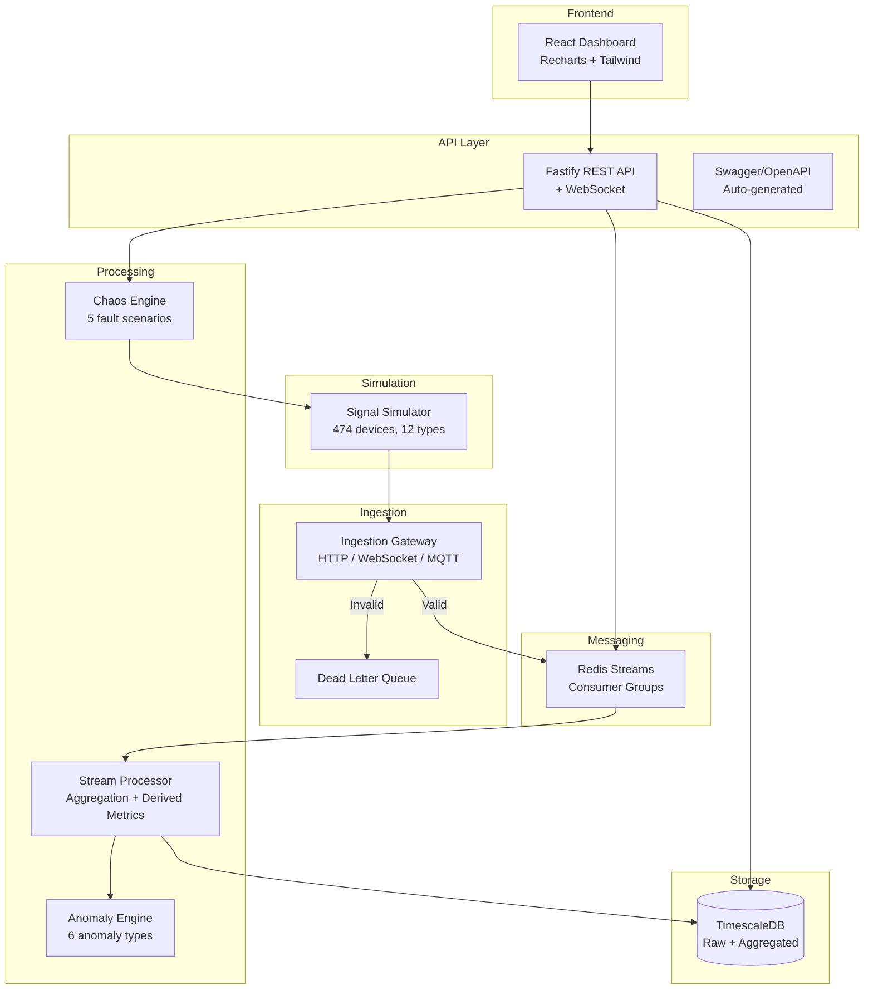

# BIM MEP IoT Backend POC

[](LICENSE)
[](https://nodejs.org)
[](https://www.typescriptlang.org)
[](https://docs.docker.com/compose/)
[](https://github.com/ceparadise168/bim-mep-poc/actions/workflows/ci.yml)

Smart Hospital Building MEP (Mechanical, Electrical, Plumbing) Equipment Management Platform - Backend POC with real-time IoT signal simulation, anomaly detection, and visualization dashboard.

## Live Demo

- Dashboard: http://57.180.82.227:5173
- API Docs (Swagger): http://57.180.82.227:3000/docs

## Screenshots

| Building Overview | 3D Visualization |
|---|---|
|  |  |

| Anomaly Center | Mobile 3D |
|---|---|
|  |  |

## Architecture



## Tech Stack

| Component | Technology |
|-----------|-----------|
| Language | TypeScript (Node.js) |
| Signal Queue | Redis Streams |
| Time-series DB | TimescaleDB (PostgreSQL) |
| Real-time Push | WebSocket |
| API | Fastify + OpenAPI |
| Dashboard | React + Recharts + Tailwind |
| Containers | Docker Compose |

## Quick Start

### Docker (Recommended)

```bash
docker-compose up
```

Services:
- Dashboard: http://localhost:5173
- API Server: http://localhost:3000
- Swagger Docs: http://localhost:3000/docs
- Ingestion Gateway: http://localhost:3100
- MQTT Broker: `localhost:1883`

`db-init` now creates schema and seeds the full 474-device registry automatically, so the API and dashboard are not empty after startup.

### Local Development

```bash
# Prerequisites: Node.js 20+, Redis, PostgreSQL/TimescaleDB

npm install

# Initialize database schema and seed devices
node --import tsx packages/stream-processor/src/init-db.ts

# Run tests
npm test

# Start services (each in separate terminal)
node --import tsx packages/signal-simulator/src/standalone.ts
node --import tsx packages/ingestion-gateway/src/standalone.ts
node --import tsx packages/stream-processor/src/standalone.ts
node --import tsx packages/api-server/src/standalone.ts
cd packages/dashboard && npm run dev
```

## Deployment

One-shot deploy to the demo EC2 instance from a local checkout:

```bash
./scripts/deploy.sh
```

The script uses [EC2 Instance Connect](https://docs.aws.amazon.com/ec2/latest/userguide/connect-using-eic.html) to push a temporary SSH key (no long-lived keys to distribute), then on the remote runs `git reset --hard origin/main` and `docker compose up -d --build --remove-orphans`. Override host / instance / key via env vars — see the script header.

## Project Structure

```
bim-mep-poc/
├── packages/
│   ├── signal-simulator/    # 474 IoT device simulators -> gateway batch publisher
│   ├── ingestion-gateway/   # HTTP/WS/MQTT signal receiver + normalizer
│   ├── stream-processor/    # Redis consumer + anomaly writer + realtime publisher
│   ├── anomaly-engine/      # Anomaly detection + chaos injection
│   ├── api-server/          # REST + WebSocket API
│   └── dashboard/           # React visualization
├── docker-compose.yml       # One-click deployment
├── Dockerfile.app           # Backend services
├── Dockerfile.dashboard     # Frontend (nginx)
└── scripts/demo-smoke.sh    # Demo verification
```

## Simulated Devices (474 total)

| Type | Count | Interval | Protocols |
|------|-------|----------|-----------|
| Chiller | 4 | 1s | BACnet IP |
| AHU | 24 | 2s | BACnet/Modbus/OPC UA |
| VFD | 48 | 1s | Modbus TCP |
| Power Panel | 12 | 5s | Modbus/OPC UA |
| UPS | 4 | 3s | Modbus/REST |
| Generator | 2 | 5s | Modbus TCP |
| Fire Pump | 6 | 10s | Modbus/MQTT |
| Elevator | 8 | 1s | OPC UA |
| Lighting Controller | 120 | 30s | BACnet/MQTT |
| Temp/Humidity Sensor | 200 | 10s | BACnet/Modbus/MQTT |
| Water Meter | 16 | 15s | MQTT/Modbus |
| Air Quality Sensor | 30 | 10s | MQTT/REST |

## API Endpoints

### REST

| Method | Path | Description |
|--------|------|-------------|
| GET | /api/v1/devices | Device list (filter, paginate) |
| GET | /api/v1/devices/:id | Device detail + latest readings |
| GET | /api/v1/devices/:id/signals | Signal history (time range, downsample) |
| GET | /api/v1/devices/:id/maintenance | Maintenance records |
| GET | /api/v1/floors/:floor/overview | Floor summary |
| GET | /api/v1/building/dashboard | Building dashboard data |
| GET | /api/v1/anomalies | Anomaly events |
| POST | /api/v1/chaos/trigger | Trigger fault injection |
| GET | /api/v1/chaos/scenarios | Available chaos scenarios |
| GET | /api/v1/analytics/energy | Energy analytics |
| GET | /api/v1/analytics/comfort | Comfort analytics |

### WebSocket

```
ws://host/ws
  subscribe: "signals:{deviceId}"     # Single device signals
  subscribe: "signals:floor:{n}"      # Floor signals
  subscribe: "anomalies"              # Real-time alerts
  subscribe: "dashboard"              # Dashboard refresh events
```

## Chaos Scenarios

1. **Chiller Failure** - Compressor current spike + AHU temperature cascade
2. **Power Anomaly** - Voltage drop + UPS switch + generator startup
3. **Sensor Drift** - Gradual temperature/humidity deviation
4. **Network Outage** - Entire floor devices go offline
5. **Water Leak** - Pressure drop + fire pump activation

## Tests

```bash
# Focused verification used for this hardening pass
npm test --workspace @bim-mep/stream-processor -- device-seeder.test.ts processor.integration-path.test.ts
npm test --workspace @bim-mep/api-server -- api-server.test.ts
npm test --workspace @bim-mep/signal-simulator -- gateway-batch-publisher.test.ts
./scripts/demo-smoke.sh
```
